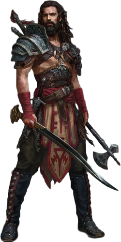

<body align="center">
    <header>
        <h1 id="first">
            BEM VINDO A AINCRAD
        </h1>
        <h3>
        SELECIONE O CAMPEÃO DESEJADO NO DEPLOYMENT-<a href="https://sirdav1d.github.io/Mod02_Proj01/" target="_blan"> AINCRAD</a>
        <h3>
    </header>
    <main>
        <section class="container_int">
          

            <figure >
                
                
                
            </figure>
          

          

                <button align="center" id="btn" type="button" value="TROCAR">
            
                </button>   
          

        </section>
    </main>
  
  #
  

           <a href="https://github.com/sirdav1d" target="_blan"> DAVID D. DOS SANTOS</a>- ALL RIGHTS RESERVED ©
        

